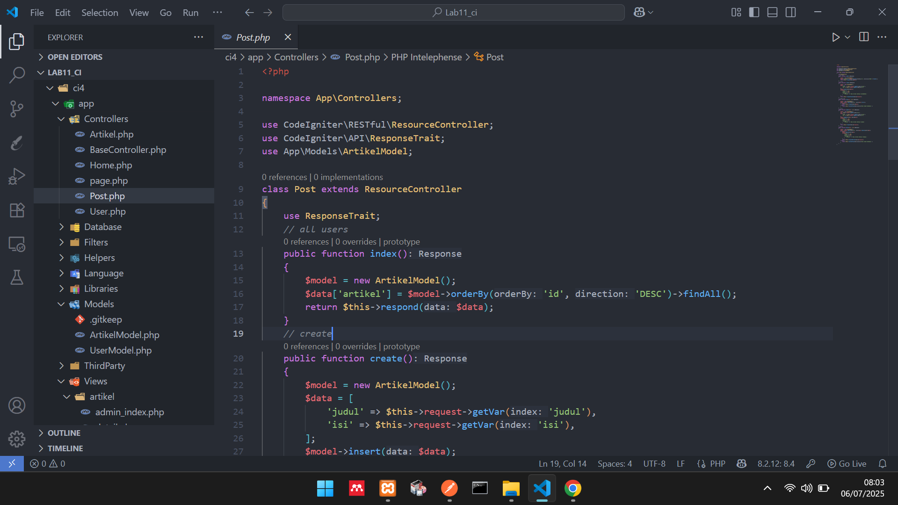
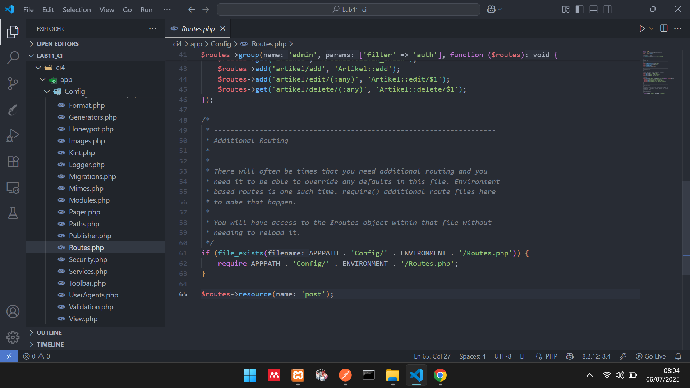
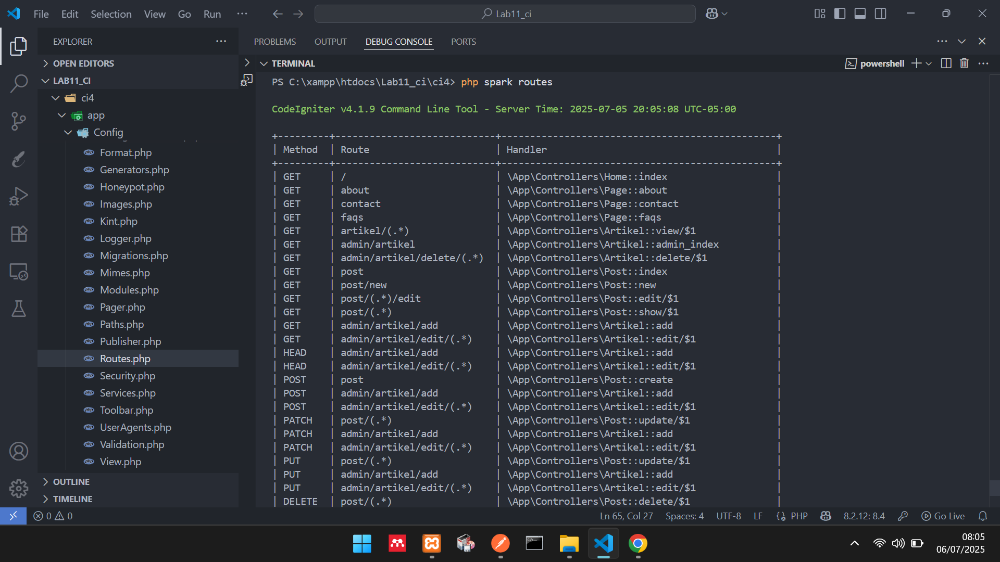
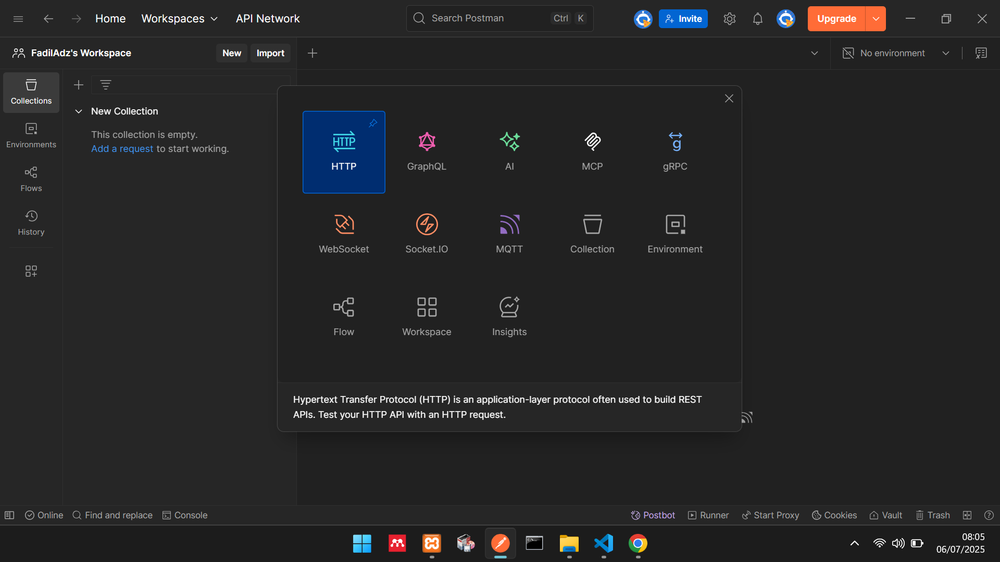
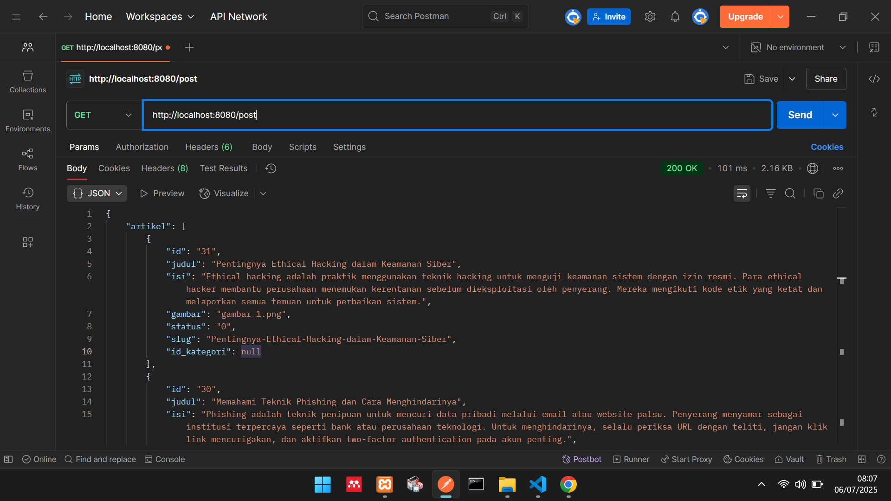
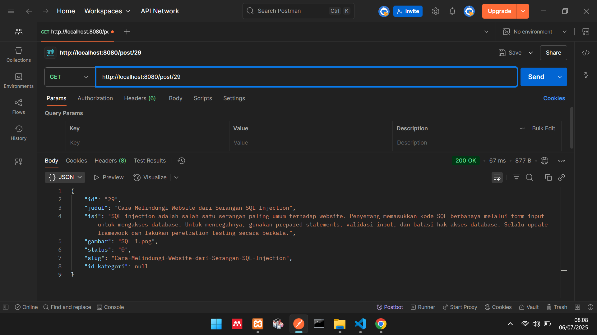
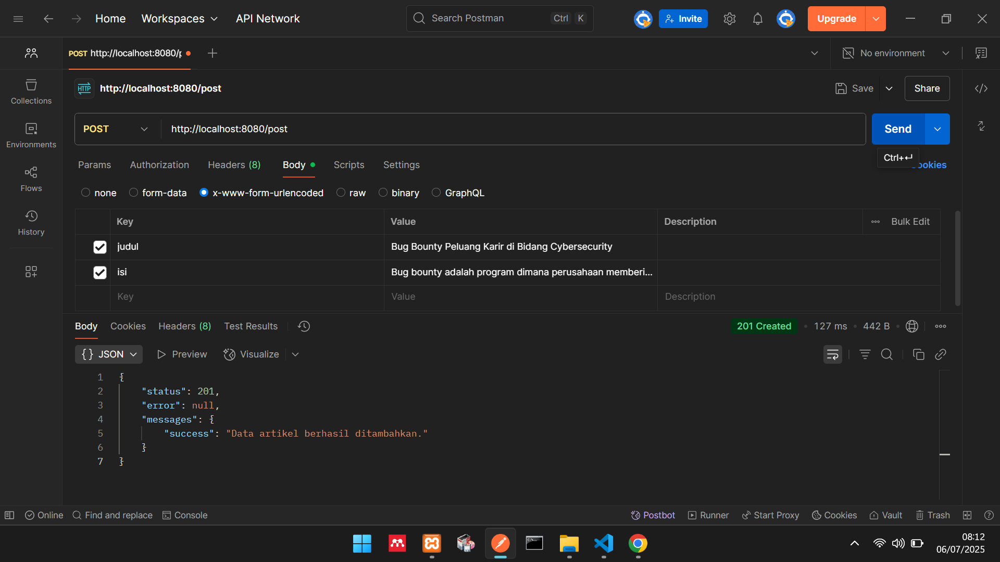
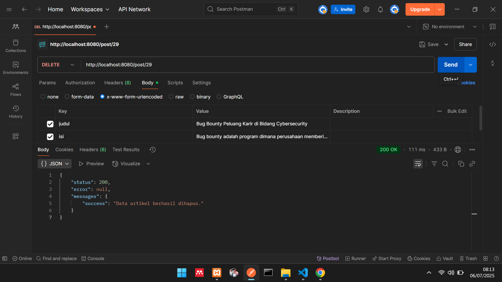

# Lab11Web & VueJS
Lab11Web adalah aplikasi web lengkap berbasis CodeIgniter 4 untuk mengelola data Artikel (CRUD, paging, pencarian, upload gambar) dengan autentikasi (login/logout, session, filter akses). Front‑end-nya dibangun sebagai SPA sederhana menggunakan Vue.js file index.html memuat struktur tampilan dan modal form, app.js mengurus pengambilan (axios.get), penambahan (axios.post), pengubahan (axios.put) dan penghapusan (axios.delete) data Artikel secara dinamis serta style.css untuk styling responsif dan modal yang menarik.

<br>

# $${\color{lightblue}Teknologi Yang Digunakan}$$
       

Postman digunakan untuk menguji dan mendokumentasikan setiap endpoint RESTful pada back‑end CodeIgniter (GET, POST, PUT, DELETE), memastikan format JSON dan status kode HTTP sudah benar sebelum diintegrasikan ke front‑end. Sementara Vue.js berperan sebagai lapisan presentasi interaktif:

Menampilkan daftar Artikel dengan v-for dan two‑way binding (v-model), Memunculkan form tambah/ubah dalam modal via v-if, Menghasilkan UI real‑time saat data diubah tanpa reload halaman.
<br> <br>


| Mata Kuliah     | Dosen Pengampu                     |
| --------- | ----------------------------- |
| **Pemrograman Web 2** | Agung Nugroho S.kom., M.Kom.      |

<br>

| NIM           | Nama Mahasiswa                |
| --------------|------------------------------ |
| **312310610** | Raul Putra Widodo             |

<!-- |Link Video Demo Aplikasi Web| [Klik Disini!]() |
| -------------------------- | --------------------- | -->

<br> 

## Cara kerja REST API menggunakan prinsip REST Server dan REST Client.
<p>REST (Representational State Transfer) adalah sebuah arsitektur desain untuk Application Programming Interface (API). API sendiri berfungsi sebagai antarmuka yang menjembatani komunikasi antar-aplikasi. Pada ekosistem REST, server bertindak sebagai penyedia data atau sumber daya (resources), sementara client melakukan permintaan (HTTP request) kepada server dengan menggunakan URI (Uniform Resource Identifier) sebagai identifikasi global. Server kemudian merespons permintaan tersebut dengan mengirimkan data kembali dalam format HTTP response. Umumnya, format data yang dipertukarkan adalah JSON, sehingga REST API dapat dengan mudah diintegrasikan ke berbagai platform, bahasa pemrograman, maupun framework.</p>

<p>Sebagai contoh, Anda dapat membangun proyek backend menggunakan REST API berbasis PHP, lalu menghubungkannya dengan antarmuka frontend yang dikembangkan menggunakan Vue.js. Dengan demikian, komponen frontend dan backend dapat saling berinteraksi secara lancar dan terstandarisasi.</p>

## Langkah-langkah Praktikum dan Persiapan
Periapan awal adalah mengunduh aplikasi REST Client, ada banyak aplikasi yang dapat digunakan untuk keperluan tersebut. Salah satunya adalah Postman. [Postman](https://www.postman.com/) merupakan aplikasi yang berfungsi sebagai REST Client, digunakan untuk testing REST API. Unduh apliasi Postman [Disini.](https://www.postman.com/downloads/)

## Membuat Model
Pada modul sebelumnya sudah dibuat ArtikelModel, pada modul ini kita akan memanfaatkan model tersebut agar dapat diakses melalui API.

## Membuat REST Controller
Pada tahap ini, kita akan membuat file REST Controller yang berisi fungsi untuk menampilkan, menambah, mengubah dan menghapus data. Masuklah ke direktori app\Controllers dan buatlah file baru bernama Post.php. Kemudian, salin kode di bawah ini ke dalam file tersebut:

```php
<?php

namespace App\Controllers;

use CodeIgniter\RESTful\ResourceController;
use CodeIgniter\API\ResponseTrait;
use App\Models\ArtikelModel;

class Post extends ResourceController
{
    use ResponseTrait;
    // all users
    public function index()
    {
        $model = new ArtikelModel();
        $data['artikel'] = $model->orderBy('id', 'DESC')->findAll();
        return $this->respond($data);
    }
    // create
    public function create()
    {
        $model = new ArtikelModel();
        $data = [
            'judul' => $this->request->getVar('judul'),
            'isi' => $this->request->getVar('isi'),
        ];
        $model->insert($data);
        $response = [
            'status' => 201,
            'error' => null,
            'messages' => [
                'success' => 'Data artikel berhasil ditambahkan.'
            ]
        ];
        return $this->respondCreated($response);
    }
    // single user
    public function show($id = null)
    {
        $model = new ArtikelModel();
        $data = $model->where('id', $id)->first();
        if ($data) {
            return $this->respond($data);
        } else {
            return $this->failNotFound('Data tidak ditemukan.');
        }
    }
    // update
    public function update($id = null)
    {
        $model = new ArtikelModel();
        $id = $this->request->getVar('id');
        $data = [
            'judul' => $this->request->getVar('judul'),
            'isi' => $this->request->getVar('isi'),
        ];
        $model->update($id, $data);
        $response = [
            'status' => 200,
            'error' => null,
            'messages' => [
                'success' => 'Data artikel berhasil diubah.'
            ]
        ];
        return $this->respond($response);
    }
    // delete
    public function delete($id = null)
    {
        $model = new ArtikelModel();
        $data = $model->where('id', $id)->delete($id);
        if ($data) {
            $model->delete($id);
            $response = [
                'status' => 200,
                'error' => null,
                'messages' => [
                    'success' => 'Data artikel berhasil dihapus.'
                ]
            ];
            return $this->respondDeleted($response);
        } else {
            return $this->failNotFound('Data tidak ditemukan.');
        }
    }
}
```

Seperti pada gambar berikut ini!



<p>Kode diatas berisi 5 method, yaitu:</p>

```php
index() = Berfungsi untuk menampilkan seluruh data pada database.
create() = Berfungsi untuk menambahkan data baru ke database.
show() = Berfungsi untuk menampilkan suatu data spesifik dari database.
update() = Berfungsi untuk mengubah suatu data pada database.
delete() = Berfungsi untuk menghapus data dari database.
```

## Membuat Routing REST API
Untuk mengakses REST API CodeIgniter, kita perlu mendefinisikan route-nya terlebih dulu.
Caranya, masuklah ke direktori app/Config dan bukalah file Routes.php. Tambahkan kode
di bawah ini:</p>

```php
$routes->resource('post');
```

Seperti pada gambar berikut!



Untuk mengecek route nya jalankan perintah berikut:

```bash
php spark routes
```

Selanjutnya akan muncul daftar route yang telah dibuat.



Seperti yang terlihat, satu baris kode routes yang di tambahkan akan menghasilkan banyak
Endpoint. Selanjutnya melakukan uji coba terhadap REST API CodeIgniter.

## Testing REST API CodeIgniter
Buka aplikasi postman dan pilih create new → HTTP Request



### Menampilkan Semua Data 
Pilih method GET dan masukkan URL berikut: http://localhost:8080/post <br>
Lalu, klik Send. Jika hasil test menampilkan semua data artikel dari database, maka pengujian
berhasil.




### Menampilkan Data Spesifik
Masih menggunakan method GET, hanya perlu menambahkan ID artikel di belakang URL seperti ini: http://localhost:8080/post/29 <br>

Selanjutnya, klik Send. Request tersebut akan menampilkan data artikel yang memiliki ID nomor 29 di database.




 ### Mengubah Data <!-- Ini Belum Ada Gambar Dokumentasi -->
Untuk mengubah data, silakan ganti method menjadi PUT. Kemudian, masukkan URL artikel yang ingin diubah. Misalnya, ingin mengubah data artikel dengan ID nomor 29, maka masukkan URL berikut: http://localhost:8080/post/29 <br>

Selanjutnya, Masukkan nama atribut tabel pada kolom KEY dan nilai data yang baru pada kolom VALUE. Kalau sudah,
klik Send.


### Menambahkan Data
Pilih method POST untuk menambahkan data baru ke database. Kemudian, masukkan URL berikut: http://localhost:8080/post/ <br>

Langsung saja klik Send, maka akan mendapatkan pesan bahwa data telah berhasil ditambahkan ke dalam database.




### Menghapus Data
Pilih method DELETE untuk menghapus data. Lalu, masukkan URL spesifik data mana yang ingin di hapus. Misalnya, ingin menghapus data nomor 29, maka URL-nya seperti ini: http://localhost:8080/post/29 <br>

Langsung saja klik Send, maka akan mendapatkan pesan bahwa data telah berhasil dihapus dari
database.



<br>

## Selanjutnya Kita Masuk Ke Dalam Praktikum VueJS
VuesJS merupakan sebuah framework JavaScript untuk membangun aplikasi web atau tampilan interface website agar lebih interaktif. VueJS dapat digunakan untuk membangun aplikasi berbasis user interface, seperti halaman web, aplikasi mobile, dan aplikasi desktop. <br>

Framework ini juga menawarkan berbagai fitur, seperti reactive data binding, component based architecture, dan tools untuk membangun aplikasi skalabel. Fitur utamanya adalah rendering dan komposisi elemen, sehingga bila pengguna hendak membuat aplikasi yang lebih kompleks akan membutuhkan routing, state management, template, build-tool, dan lain sebagainya.Adapun library VueJS berfokus pada view layer sehingga framework ini mudah untuk diimplementasikan dan diintegrasikan dengan library lain. Selain itu, VueJS juga terkenal mudah digunakan karena memiliki sintaksis yang sederhana dan intuitif, memungkinkan pengembang untuk membangun aplikasi web dengan mudah. Untuk lebih lengkapnya dapat dipelajari pada dokumentasinya pada websitenya https://vuejs.org/guide/introduction

## Langkah-langkah Untuk Memulainya
Untuk memulai penggunaan framework Vuejs, dapat dialkukan dengan menggunakan npm, atau bisa juga dengan cara manual Untuk praktikum kali ini kita akan gunakan cara manual. Yang diperlukan adalah library Vuejs, Axios untuk melakukan call API REST. Menggunakan CDN.

### Library VueJS
```javascript
<script src="https://unpkg.com/vue@3/dist/vue.global.js"></script>
```

### Library Axios
```javascript
<script src="https://unpkg.com/axios/dist/axios.min.js"></script>
```

## 📁 Struktur Folder
```
lab11_vuejs/
├── index.html
├── assets/
│   ├── css/
│   │   └── style.css
│   └── js/
│       └── app.js
```

### Menampilkan Data
#### File index.html
```html
<!DOCTYPE html>
<html lang="id">
<head>
    <meta charset="UTF-8">
    <meta name="viewport" content="width=device-width, initial-scale=1.0">
    <title>Frontend Artikel VueJS</title>
    <!-- CDN untuk VueJS 3 -->
    <script src="https://unpkg.com/vue@3/dist/vue.global.js"></script>
    <!-- CDN untuk Axios -->
    <script src="https://unpkg.com/axios/dist/axios.min.js"></script>
    <!-- Link ke CSS kustom -->
    <link rel="stylesheet" href="assets/css/style.css">
</head>
<body>
    <div id="app">
        <h1>Daftar Artikel</h1>

        <!-- Tombol Tambah Data -->
        <button id="btn-tambah" @click="tambah">Tambah Data</button>

        <!-- Modal Form Tambah dan Ubah Data -->
        <div class="modal" v-if="showForm">
            <div class="modal-content">
                <span class="close" @click="showForm = false">&times;</span>
                <form id="form-data" @submit.prevent="saveData">
                    <h3 id="form-title">{{ formTitle }}</h3>
                    <div>
                        <label for="judul" class="form-label">Judul Artikel</label> <!-- Label untuk Judul -->
                        <input type="text" name="judul" id="judul" v-model="formData.judul" placeholder="Judul" required>
                    </div>
                    <div>
                        <label for="isi" class="form-label">Isi Artikel</label> <!-- Label untuk Isi -->
                        <textarea name="isi" id="isi" rows="10" v-model="formData.isi" placeholder="Isi Artikel"></textarea>
                    </div>
                    <div>
                        <label for="status" class="form-label">Status</label> <!-- Label untuk Status -->
                        <select name="status" id="status" v-model="formData.status">
                            <option v-for="option in statusOptions" :value="option.value" :key="option.value">
                                {{ option.text }}
                            </option>
                        </select>
                    </div>
                    <!-- Hidden input untuk ID artikel saat edit -->
                    <input type="hidden" id="id" v-model="formData.id">
                    <button type="submit" id="btnSimpan">Simpan</button>
                    <button type="button" @click="showForm = false">Batal</button>
                </form>
            </div>
        </div>

        <!-- Tabel untuk menampilkan data artikel -->
        <table>
            <thead>
                <tr>
                    <th>ID</th>
                    <th>Judul</th>
                    <th>Status</th>
                    <th>Aksi</th>
                </tr>
            </thead>
            <tbody>
                <!-- Loop melalui array artikel -->
                <tr v-for="(row, index) in artikel" :key="row.id">
                    <td class="center-text">{{ row.id }}</td>
                    <td>{{ row.judul }}</td>
                    <td>{{ statusText(row.status) }}</td>
                    <td class="center-text">
                        <a href="#" @click.prevent="edit(row)">Edit</a>
                        <a href="#" @click.prevent="hapus(index, row.id)">Hapus</a>
                    </td>
                </tr>
                <tr v-if="artikel.length === 0">
                    <td colspan="4" class="center-text">Tidak ada artikel tersedia.</td>
                </tr>
            </tbody>
        </table>
    </div>

    <!-- Link ke JavaScript aplikasi VueJS kita -->
    <script src="assets/js/app.js"></script>
</body>
</html>
```

<br>

#### File app.js
```javascript
const { createApp } = Vue;

// Tentukan lokasi API REST End Point Anda
// Contoh: 'http://localhost:8080/post' jika Anda mengaksesnya langsung
// atau 'http://localhost/labci4/public/post' jika public bukan root
const apiUrl = 'http://localhost/Lab11_ci/ci4/public/post'; // Sesuaikan ini dengan URL API Anda!

createApp({
    data() {
        return {
            artikel: [], // Array untuk menyimpan data artikel
            
            // Objek untuk data form (digunakan untuk tambah dan ubah)
            formData: {
                id: null,
                judul: '',
                isi: '',
                status: 0 // Default status (misal: 0 untuk Draft)
            },
            
            showForm: false, // Kontrol tampilan modal form
            formTitle: 'Tambah Data', // Judul modal form
            
            // Opsi untuk dropdown status
            statusOptions: [
                {text: 'Draft', value: 0}, // Sesuaikan value dengan kolom status di DB (0/1 atau 'Draft'/'published')
                {text: 'Publish', value: 1} // Jika status di DB Anda adalah string 'Draft'/'published', gunakan itu sebagai value
            ],
        };
    },
    
    // Dipanggil saat instance Vue selesai di-mount
    mounted() {
        this.loadData();
    },
    
    methods: {
        // Fungsi untuk memuat data artikel dari API
        loadData() {
            axios.get(apiUrl)
                .then(response => {
                    // Jika API mengembalikan { artikel: [...] }, akses response.data.artikel
                    // Jika API hanya mengembalikan [...], akses response.data
                    this.artikel = response.data.artikel || response.data; 
                    console.log("Data artikel dimuat:", this.artikel);
                })
                .catch(error => {
                    console.error("Error memuat data:", error);
                    alert("Gagal memuat data artikel. Cek konsol untuk detail.");
                });
        },
        
        // Fungsi untuk mengubah tampilan status (dari angka/boolean ke teks)
        statusText(status) {
            // Sesuaikan logika ini dengan bagaimana status disimpan di database Anda
            // Jika di DB adalah '0' atau '1' (string/number)
            if (status == 1 || status == '1' || status === 'published') {
                return 'Publish';
            } else if (status == 0 || status == '0' || status === 'Draft') {
                return 'Draft';
            }
            return ''; // Default jika status tidak dikenali
        },
        
        // Fungsi untuk menampilkan form tambah data
        tambah() {
            this.showForm = true;
            this.formTitle = 'Tambah Data';
            // Reset formData agar kosong untuk entri baru
            this.formData = {
                id: null,
                judul: '',
                isi: '',
                status: 0 // Default status untuk form tambah
            };
        },
        
        // Fungsi untuk menghapus artikel
        hapus(index, id) {
            if (confirm('Yakin ingin menghapus data ini?')) {
                axios.delete(apiUrl + '/' + id)
                    .then(response => {
                        alert(response.data.messages.success); // Tampilkan pesan sukses dari API
                        this.artikel.splice(index, 1); // Hapus item dari array di frontend
                        // Alternatif: this.loadData(); // Memuat ulang semua data dari server
                    })
                    .catch(error => {
                        console.error("Error menghapus data:", error.response || error);
                        alert("Gagal menghapus artikel: " + (error.response?.data?.messages?.error || error.message || "Terjadi kesalahan."));
                    });
            }
        },
        
        // Fungsi untuk mengisi form dengan data artikel yang akan diubah
        edit(data) {
            this.showForm = true;
            this.formTitle = 'Ubah Data';
            // Isi formData dengan data dari baris yang dipilih
            this.formData = {
                id: data.id,
                judul: data.judul,
                isi: data.isi,
                // Pastikan status sesuai dengan value di statusOptions (misal: 0 atau 1)
                status: data.status == 'published' ? 1 : (data.status == 'Draft' ? 0 : data.status)
            };
            console.log("Mengedit item:", this.formData);
        },
        
        // Fungsi untuk menyimpan atau mengubah data (dipanggil saat form disubmit)
        saveData() {
            // Jika formData.id ada, berarti ini adalah operasi ubah (PUT)
            if (this.formData.id) {
                axios.put(apiUrl + '/' + this.formData.id, this.formData)
                    .then(response => {
                        alert(response.data.messages.success || "Artikel berhasil diubah!");
                        this.loadData(); // Muat ulang data setelah perubahan
                        this.showForm = false; // Sembunyikan form
                        console.log('Item diperbarui:', response.data);
                    })
                    .catch(error => {
                        console.error("Error memperbarui item:", error.response || error);
                        alert("Gagal mengubah artikel: " + (error.response?.data?.messages?.error || error.message || "Terjadi kesalahan."));
                    });
            } else {
                // Jika formData.id null, berarti ini adalah operasi tambah (POST)
                axios.post(apiUrl, this.formData)
                    .then(response => {
                        alert(response.data.messages.success || "Artikel berhasil ditambahkan!");
                        this.loadData(); // Muat ulang data setelah penambahan
                        this.showForm = false; // Sembunyikan form
                        console.log('Item ditambahkan:', response.data);
                    })
                    .catch(error => {
                        console.error("Error menambahkan item:", error.response || error);
                        alert("Gagal menambahkan artikel: " + (error.response?.data?.messages?.error || error.message || "Terjadi kesalahan."));
                    });
            }
            
            // Reset form data setelah operasi selesai (atau di dalam then/catch block)
            this.formData = {
                id: null,
                judul: '',
                isi: '',
                status: 0
            };
        },
    },
}).mount('#app'); // Mount aplikasi Vue ke elemen dengan id "app"
```

<br>

#### File style.css
```css
/* Styling dasar untuk aplikasi VueJS */
#app {
    margin: 0 auto;
    width: 900px;
    padding: 20px; /* Tambahkan padding agar tidak terlalu mepet */
    font-family: sans-serif; /* Atur font-family */
}

h1 {
    text-align: center;
    color: #3152d6;
    margin-bottom: 20px;
}

table {
    min-width: 700px;
    width: 100%;
    border-collapse: collapse; /* Hilangkan jarak antar border cell */
    margin-top: 20px;
    box-shadow: 0 2px 8px rgba(0,0,0,0.1); /* Tambahkan sedikit bayangan */
    border-radius: 8px; /* Sudut membulat */
    overflow: hidden; /* Pastikan sudut membulat diterapkan */
}

th {
    padding: 12px 10px;
    background: #5778ff !important;
    color: #ffffff;
    text-align: left; /* Atur teks ke kiri */
}

tr td {
    border-bottom: 1px solid #eff1ff;
    padding: 10px;
}

tr:nth-child(odd) {
    background-color: #eff1ff;
}

td {
    padding: 10px;
}

.center-text {
    text-align: center;
}

td a {
    margin: 0 5px; /* Sesuaikan margin untuk link aksi */
    text-decoration: none; /* Hilangkan underline */
    color: #3152d6; /* Warna link */
}

td a:hover {
    text-decoration: underline; /* Munculkan underline saat hover */
}

/* Styling untuk form */
#form-data {
    width: 100%; /* Lebar form menyesuaikan modal-content */
}

form input,
form select,
form textarea {
    width: 100%;
    margin-bottom: 10px; /* Tambahkan margin-bottom */
    padding: 10px;
    box-sizing: border-box;
    border: 1px solid #ccc;
    border-radius: 4px; /* Sudut membulat */
}

form div {
    margin-bottom: 10px; /* Sesuaikan margin-bottom untuk setiap div form */
    position: relative;
}

form button {
    padding: 10px 20px;
    margin-top: 10px;
    margin-right: 10px;
    cursor: pointer;
    border: none;
    border-radius: 5px; /* Sudut membulat */
    font-weight: bold;
    transition: background-color 0.3s ease; /* Transisi halus */
}

#btn-tambah {
    margin-bottom: 15px;
    padding: 12px 25px;
    cursor: pointer;
    background-color: #28a745; /* Warna hijau untuk tambah */
    color: #ffffff;
    border: 1px solid #28a745;
    border-radius: 5px;
    font-weight: bold;
    transition: background-color 0.3s ease;
}

#btn-tambah:hover {
    background-color: #218838;
}

#btnSimpan {
    background-color: #3152d6;
    color: #ffffff;
    border: 1px solid #3152d6;
}

#btnSimpan:hover {
    background-color: #2640aa;
}

form button[type="button"] { /* Untuk tombol Batal */
    background-color: #6c757d;
    color: #ffffff;
}

form button[type="button"]:hover {
    background-color: #5a6268;
}

/* Styling Modal */
.modal {
    display: block; /* Default to block for v-if to toggle */
    position: fixed;
    z-index: 1000; /* Pastikan modal di atas konten lain */
    left: 0;
    top: 0;
    width: 100%;
    height: 100%;
    overflow: auto;
    background-color: rgba(0,0,0,0.6); /* Lebih gelap sedikit dari modul */
    display: flex; /* Gunakan flexbox untuk centering */
    justify-content: center;
    align-items: center;
}

.modal-content {
    background-color: #fefefe;
    padding: 30px; /* Tambah padding */
    border: 1px solid #888;
    width: 90%; /* Responsif */
    max-width: 600px; /* Batasi lebar maksimum */
    border-radius: 8px; /* Sudut membulat */
    box-shadow: 0 5px 15px rgba(0,0,0,0.3); /* Bayangan lebih kuat */
    position: relative; /* Untuk posisi tombol close */
}

.close {
    color: #aaa;
    float: right; /* Atur float untuk tombol close */
    font-size: 28px;
    font-weight: bold;
    cursor: pointer;
    position: absolute; /* Posisi absolut di dalam modal-content */
    top: 10px;
    right: 15px;
}

.close:hover,
.close:focus {
    color: #000;
    text-decoration: none;
    cursor: pointer;
}

h3#form-title {
    text-align: center;
    color: #3152d6;
    margin-bottom: 20px;
}

/* Responsive adjustments */
@media (max-width: 768px) {
    #app {
        width: 100%;
        padding: 10px;
    }
    table {
        font-size: 0.9em;
    }
    th, td {
        padding: 8px;
    }
}
```

<br> <br>

## Hasil Dokumentasi Lab11_vuejs

<p>GIF ini mendemonstrasikan hasil akhir dari web <b>Lab11Web</b>, sebuah platform manajemen artikel berbasis <b>Vue.js</b> yang terintegrasi dengan RESTful API. Tampilan utama menampilkan tabel daftar artikel dengan informasi ID, judul, status publikasi, serta aksi yang dapat dilakukan seperti <b>Edit</b> dan <b>Hapus</b>. Di bagian atas tersedia tombol “Tambah Data” yang memicu kemunculan modal form untuk input artikel baru secara dinamis. Seluruh interaksi termasuk pengambilan, penyimpanan, dan penghapusan data dilakukan secara real-time tanpa perlu memuat ulang halaman, menunjukkan implementasi arsitektur <b>Single Page Application (SPA)</b> yang efisien, interaktif, dan responsif.</p>
